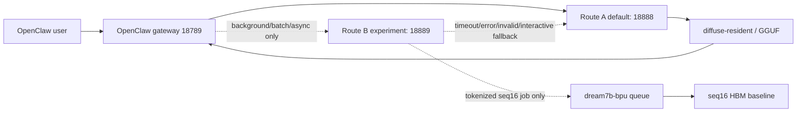

# Dream7B OpenClaw Two-Track Deployment Plan 2026-06-22

## Decision

Proceed with two tracks, rollback first, and evidence before traffic.

- Product Route A stays on `OpenClaw -> 18888 -> diffuse-resident/GGUF`.
- R&D Route B uses `18889` only as an isolated BPU queue / true-batch experiment endpoint.
- Do not overwrite, delete, or break `18888`.
- Do not delete the existing `seq16` queue baseline.
- Do not route foreground OpenClaw replies to BPU/true-batch until quality, latency, stability, and rollback evidence all pass.

Latest read-only audit:

```text
LATEST:tmp/product_guardrail_snapshots/dream7b_two_track_deployment_audit_*/dream7b_two_track_deployment_audit.json
LATEST:tmp/product_guardrail_snapshots/dream7b_two_track_deployment_audit_*/dream7b_two_track_deployment_audit.md
```

Audit verdict: `ok_dream7b_two_track_deployment_audit`. The 18888 gateway,
OpenClaw gateway, and BPU queue are active/enabled. The 18888 backend is
`diffuse-resident`. The 18889 experimental endpoint is currently inactive,
which matches the default-disabled experiment policy. Queue pending/processing
counts are `0/0`.

## Current Chain



## Risk Points

1. `18888` is the protected product path. Any change to its unit, gateway script, tokenizer venv, model path, or port binding must have a backup and rollback command before deployment.
2. BPU queue is a throughput/telemetry baseline, not a default single-user chat path. Latest single text queue report is still not accepted as a successful front-end reply path.
3. Current BPU generation remains structurally limited by `seq16`. Normal OpenClaw prompts can be truncated to a small tail window, so seq16 cannot carry long replies.
4. BPU logits quality is not passing. Current promotion gate is blocked by logits, Chinese generation, same-workload comparison, rollback, and missing candidate artifact evidence.
5. true-batch B=16 is useful prior runtime evidence, but it does not prove production-quality chat output.
6. The 2026-06-23 cloud run produced a complete `seq128, B=1` HBM package,
   but it is compile evidence only. It has not been loaded, run, or quality
   validated on S100P, and it does not change the foreground traffic decision.

## 18889 Experiment Port

New files:

```text
configs/dream7b_queue_adapter_policy.json
configs/systemd/dream7b-bpu-experimental-gateway-18889.service
scripts/dream7b_experimental_18889_gateway.py
scripts/probes/dream7b_two_track_deployment_audit.py
```

18889 service template is present but not enabled by default. It is intentionally isolated:

```bash
cd /root/.openclaw/workspace
python3 scripts/dream7b_experimental_18889_gateway.py \
  --config configs/dream7b_queue_adapter_policy.json \
  --host 127.0.0.1 \
  --port 18889
```

Systemd template:

```text
configs/systemd/dream7b-bpu-experimental-gateway-18889.service
```

Do not enable this service until the local script and policy have been copied to S100P and the preflight audit shows 18888 remains healthy.

## Queue Adapter Contract

The adapter enforces a conservative contract:

- Allowed task classes: `background`, `batch`, `async`, `offline_report`.
- Forbidden task classes: `interactive`, `chat`, `foreground`.
- Interactive or missing metadata requests fall back to Route A.
- BPU queue admission requires `metadata.bpu_tokens`.
- Current admitted token length is exactly `16`, matching the existing seq16 queue baseline.
- Missing, invalid, empty, garbled, timeout, or queue-error cases fall back to Route A.
- Accepted BPU jobs return a job receipt, not a production-quality chat claim.

This keeps long OpenClaw prompts out of seq16 and prevents silent truncation.

## Quality And Benchmark Gates

Promotion to any foreground traffic requires all rows to pass:

| Gate | Required Evidence | Current Status |
| --- | --- | --- |
| Route A health | 18888 health backend is `diffuse-resident`; OpenClaw 18789 live | pass |
| 18889 isolation | 18889 disabled or explicitly isolated; no 18888 overwrite | pass |
| Queue baseline retention | seq16 HBM artifacts still present; queue service active | pass |
| Long prompt handling | seq128 or seq256 HBM candidate prevents prompt tail truncation | compile artifact exists for seq128; S100P load/runtime/quality unverified |
| Logits quality | BF16/CPU reference vs BPU: entropy, top1/top5 overlap, KL/cosine, argmax agreement | blocked |
| Chinese quality | Three-question Chinese generation with zero failed/garbled replies | blocked |
| Same workload benchmark | B=1/4/16 latency, throughput, cold/warm latency, failed rate | blocked |
| HBM reload evidence | cold/warm HBM load count, flush count, load-once/segment-major resident proof | blocked |
| Fallback | 18889 failure auto-falls back to 18888 | adapter designed, needs live test |
| Rollback | service/unit/script backup and rollback log | blocked until 18889 live test |

## Next Execution Steps

1. Copy the new 18889 gateway, policy, and service template to S100P without enabling the service.
2. Start 18889 manually in a short test window and run `/health`.
3. Send one interactive request to 18889 and confirm it falls back to 18888.
4. Send one background request without `metadata.bpu_tokens` and confirm it falls back to 18888.
5. Send one background request with exactly 16 `metadata.bpu_tokens` and confirm a queue receipt is created.
6. Run the audit probe again and verify 18888 stays live, queue pending/processing drains, and no foreground traffic is routed to BPU.
7. Route B compile work is paused after the 2026-06-23 seq128 package. Do not compile seq256. If reopened, start from board-side load/runtime checks of the existing seq128 package, not another cloud compile.

## Current Traffic Decision

Do not expand foreground traffic to BPU.

Route A is demo-ready and protected. Route B is structurally prepared as an isolated experiment, but promotion remains blocked until larger sequence length, logits quality, Chinese generation quality, warm latency, stability, and rollback evidence pass.

Latest closure: `docs/dream7b_seq128_cloud_compile_closure_2026-06-23.md`.
The larger sequence compile artifact now exists, but promotion remains blocked
because runtime and quality evidence are still missing.
