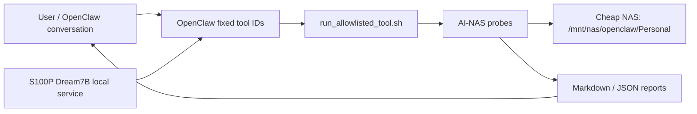

# Low-Cost AI-NAS MVP v1

## Next Demo Entrypoint

Shortest reproducible path for the Dream7B/S100P story:

```bash
python3 scripts/probes/dream7b_perf_identity_probe.py --base-url http://127.0.0.1:18888
python3 scripts/probes/dream7b_perf_identity_probe.py --base-url http://127.0.0.1:18888 --max-tokens 8 --warn-ttft-ms 5000
python3 scripts/probes/ai_nas_edge_cloud_router_probe.py
python3 scripts/probes/ai_nas_appliance_experience_acceptance_probe.py
```

Use `docs/dream7b_s100p_next_work_runbook.md` for the recording sequence and
`docs/community/dream7b-s100-bpu-deploy/SKILL.md` for the developer-community
skill package.

Title: 低成本 AI-NAS Copilot：用便宜 NAS + S100P + OpenClaw 平替高端 AI NAS 智能层

One-line positioning:

> This project is the local AI intelligence layer for a low-cost NAS, not a replacement NAS OS.

便宜 NAS 继续负责存储、RAID、快照、备份、权限、共享、移动 App 和厂商服务。S100P 负责本地 AI 推理和受控任务执行。OpenClaw 负责把自然语言转成 allowlisted、可审计的工具调用。

## Architecture



## MVP Scope

P0 demo capabilities:

- Personal library inventory for `Movies`, `Documents`, `Photos`, and `Inbox`.
- Bounded AI-NAS movie-sort demo probe (`ai_nas_movie_sort_demo_probe`) implemented as a source-controlled Python probe with a shell wrapper, so the same approved demo/report path contract works in local development and OpenClaw deployment.
- SQLite/FTS-backed Personal index with incremental size/mtime change detection, SHA256 only for changed files, scan status, failure records, and JSON/Markdown compatibility reports.
- Background index daemon readiness (`ai_nas_index_daemon_readiness`) with bounded multi-cycle index checks, daemon SQLite state, stale-lock recovery, filesystem watcher/polling capability detection, change-log visibility, and a service-unit draft without starting a daemon.
- Background index daemon smoke (`ai_nas_index_daemon_smoke`) that runs create/update/delete changes against an isolated Personal fixture, verifies real SQLite/FTS `change_log` detection, and reports detection P50/P95/P99 without installing a resident daemon or touching real Personal data.
- Resident index daemon child-process probe (`ai_nas_index_daemon_resident`) that starts an owned polling worker against an isolated fixture, mutates files while the worker is running, verifies heartbeat rows plus add/update/delete `change_log` detection, and reports P50/P95/P99 detection latency without installing systemd or touching real Personal data.
- Production index daemon service artifacts: `scripts/probes/ai_nas_index_daemon.py` is the long-running resident poller, `configs/systemd/ai-nas-index-daemon.service` is the installable systemd template, and `ai_nas_index_systemd_daemon_install` verifies active/enabled service state, restart policy, and optional observed daemon cycles without installing or starting services.
- Rename/move detection acceptance (`ai_nas_index_rename_detection`) that renames an isolated fixture file, verifies old-path `deleted` plus new-path `added` `change_log` rows, matches SHA256, and emits a `rename_or_move` candidate without touching real Personal data.
- Index observability contract (`ai_nas_index_observability_contract`) that validates queryable last scan timestamps, failed files, queue progress, recent changes, mtime/hash updates, and no-content-invented parse failures over a bounded SQLite/FTS fixture.
- SQLite index integrity contract (`ai_nas_sqlite_index_integrity_contract`) that verifies required tables/indexes, PRAGMA integrity checks, records/FTS/vector row consistency, orphan cleanup after deleted files, and grounded search evidence.
- Incremental scan efficiency contract (`ai_nas_incremental_scan_efficiency_contract`) that proves no-change SQLite/FTS scans do not re-extract unchanged files, while a changed scan only rebuilds added/updated files and records deleted files in `change_log`.
- Index/search isolation SLO acceptance (`ai_nas_index_search_isolation_slo`) that refreshes SQLite/FTS in the background while concurrent interactive searches must keep returning grounded matches with reasons, evidence, confidence, and P95/P99 latency within SLO.
- Natural-language file search over file names, paths, metadata, tags, extracted text previews, and summaries, with per-result reasons, evidence snippets, confidence, and search source.
- Controlled Personal corpus seeding (`ai_nas_controlled_personal_seed`) that creates a bounded, realistic NAS-backed test set for production soak and portal demos only when `--execute` is explicit; it is create-only by default and reports every planned or written path.
- Permission-aware search (`ai_nas_permission_aware_search`) that applies a local role/path/sensitivity policy overlay, returns evidence only for allowed files, and redacts denied candidates until production NAS ACL/user mapping is integrated.
- Production NAS ACL/user mapping readiness (`ai_nas_acl_mapping_readiness`) that read-only checks Personal root visibility, owner/group/mode samples, POSIX ACL and identity tooling, SMB/user mapping hints, and principal mapping config blockers before claiming real ACL enforcement.
- Local lightweight embedding-search interface (`local_hash_embedding_v1`) backed by SQLite vector rows, cosine ranking, evidence snippets, confidence, and explicit limitations before production CLIP/sentence-transformer models are installed.
- Production embedding backend readiness (`ai_nas_embedding_backend_readiness`) that checks local-only sentence-transformer and CLIP/open_clip/transformers runtimes, configured model directories, optional smoke embeddings, SQLite vector rows, and exact blockers without downloading models or calling external networks.
- Production embedding runtime contract (`ai_nas_embedding_runtime_contract`) that separates local fallback vector plumbing from production sentence-transformer/CLIP readiness, reports missing runtime/model requirements, and records no-download/no-network/no face-recognition acceptance rules. The production readiness gate keeps the `local_hash_embedding_v1` fallback warning only while production text embedding or image CLIP smoke evidence is missing.
- Semantic query acceptance (`ai_nas_semantic_query_acceptance`) for the product-critical fuzzy query classes: "last year's renovation contract", "child beach photo", and "reimbursement invoice"; each accepted top result must include reasons, evidence snippets, confidence, and explicit limitations for unsupported person/CLIP semantics.
- Search evidence contract acceptance (`ai_nas_search_evidence_contract`) across SQLite/FTS text search, local hash embedding search, photo semantic search, folder RAG, mixed case packet, and user-facing case results; accepted results must carry path/original path, reasons, evidence snippets, confidence, and audit-safe grounding.
- Search confidence calibration contract (`ai_nas_search_confidence_calibration_contract`) that prevents unsupported/private-identifier queries from becoming overconfident, keeps child/person photo results metadata-only with explicit no-face-recognition limitations, and verifies strong contract/invoice queries remain grounded.
- Multimodal intent routing contract (`ai_nas_multimodal_intent_routing_contract`) that decomposes the target contract/invoice/chat screenshot query into document, visual, payment, report, approval, and audit intents, then verifies routes through SQLite/FTS, local embedding, photo semantic search, folder RAG, case packet, and human-confirmed approval suggestions.
- One-click auditable evidence reports with matched file list, reasons, snippets, dates, amounts, payment nodes, original paths, confidence, and copy-only organizing suggestions.
- Mixed-source case packet (`ai_nas_case_packet`) for workflows such as `2024 renovation payment contract invoice receipt chat screenshot`, merging SQLite text/FTS, local hash embedding, and photo semantic search into one grounded report with rejected candidates, explicit gaps, and copy-only organizing suggestions.
- End-to-end appliance experience acceptance (`ai_nas_appliance_experience_acceptance`) for the target query `2024 renovation payment contract invoice receipt chat screenshot`, requiring related files, match reasons, evidence snippets, summaries, amount/date/payment nodes, original paths, confidence, copyable organizing suggestions, one-click reports, approval gating, rollback manifest contract, and audit evidence.
- Static operator portal contract (`ai_nas_operator_portal_contract`) that validates a single HTML/JSON entry surface for grounded search results, payment nodes, copy suggestions, one-click report paths, approval queue, blocked destructive actions, audit state, latest production readiness, long-soak watcher status, Dream7B interaction latency, operational SLO status, objective traceability, production dependency status, and blocker runbook verification commands.
- Operator portal server (`ai_nas_operator_portal_server`) that serves the latest portal HTML plus `/api/health`, `/api/latest`, `/api/latest.goal_progress`, `/api/latest.operator_decisions`, `/api/services`, `/api/portal-report`, `/api/contracts/operator-portal`, and `POST /api/refresh`; `/api/services` adds live read-only Dream7B/OpenClaw health and S100P systemd service status to the portal, `/api/latest` exposes a compact `soak_watcher_status` for the active NAS-backed soak, and the visible Live Controls refresh button can optionally perform a read-only SSH/SCP sync of S100P evidence JSON before regenerating bounded portal reports. Live Controls also provide an opt-in Auto toggle with a bounded interval input for demo monitoring. It does not execute NAS actions or modify source Personal files.
- Production dependency evidence bundle (`ai_nas_production_dependency_bundle`) that consolidates NAS mount/ACL, text embedding, image CLIP, OCR, model/OpenClaw health, systemd restart-policy, and recovery-drill evidence into one read-only operator report.
- Production blocker runbook contract (`ai_nas_production_blocker_runbook_contract`) that maps blockers and production warnings from the latest production readiness gate, with a cold-start fallback to the current baseline findings, to an owner category, remediation steps, AI-NAS verification commands, and acceptance evidence without installing dependencies or mutating services.
- Evidence catalog contract (`ai_nas_evidence_catalog_contract`) that indexes AI-NAS report provenance into SQLite with top-level, audit-field, and filename-mapped tool ID attribution, verdicts, generated timestamps, SHA256 hashes, latest-report selection, parse errors, forbidden audit flag visibility, a `latest_evidence_reports` view, and allowlisted-tool report coverage.
- Objective traceability contract (`ai_nas_objective_traceability_contract`) that maps the original AI-NAS Copilot Appliance objective to current evidence reports, limited areas, missing evidence, and explicit production blockers so future work cannot drift toward a narrower NAS-OS/file-manager target.
- Goal completion audit (`ai_nas_goal_completion_audit`) that maps the active three-workstream goal to authoritative evidence for NAS soak/gate, Operator Portal demo readiness, and Dream7B interaction readiness. It is intentionally stricter than the production gate for this thread: it requires a fresh 21600-second NAS-backed soak plus watcher-triggered final gate/runbook before reporting `ok`.
- Goal completion finalizer (`ai_nas_goal_completion_finalizer`) that waits for the soak watcher to verify the fresh 21600-second NAS report plus final gate/runbook, then runs the strict goal completion audit and writes `long_soak_jobs/goal_completion_finalizer_latest.json` for Portal and operator review.
- Evidence freshness contract (`ai_nas_evidence_freshness_contract`) that verifies production-readiness reports are present, fresh, attributable to expected tool IDs/verdicts, and free of forbidden destructive audit flags; latest-report selection uses report `generated_at` first and file mtime only as a fallback.
- Portable NAS adapter contract (`ai_nas_portable_nas_adapter_contract`) that proves AI-NAS can switch between arbitrary mounted NAS Personal roots, keep SQLite/FTS indexes and reports outside source trees, and return confined grounded paths.
- Production readiness gate (`ai_nas_production_readiness_gate`) that blocks production-ready claims until current evidence proves NAS-backed SQLite/FTS indexing, resident daemon behavior, P95/P99 queue soak, production embeddings/CLIP, OCR, photo pipeline, real NAS ACL mapping, model-service recovery, appliance experience, and OpenClaw governance. Production-only warnings for systemd daemon installation, NAS-backed long soak, real service recovery drill, fallback embedding/photo semantics, and missing OCR runtime are cleared only by matching current `ok` evidence reports; the NAS-backed long-soak warning also requires the gate to independently verify at least 21600 elapsed seconds, at least 21600 configured minimum seconds, and at least 100 indexed files.
- Dry-run approval manifest (`ai_nas_action_approval_manifest`) that turns grounded copy-only suggestions into exact action IDs with source hashes, target paths, preconditions, confirmation phrase, rollback plan, blocked destructive actions, and audit metadata without executing copy/delete/move/overwrite.
- Action manifest integrity contract (`ai_nas_action_manifest_integrity`) that proves executor-side manifest SHA256, action ID, source hash, and approval phrase tamper checks reject modified approval packets before execution.
- Operator approval inbox (`ai_nas_operator_approval_inbox`) that turns approval manifests into a report-only pending-decision queue with exact approval phrases, source-hash completeness, rollback-plan completeness, blocked destructive actions, decision options, and audit status.
- Approved copy executor (`ai_nas_action_execute_copy`) that accepts only an approval manifest path plus exact approval phrase, verifies manifest SHA256 and action IDs, re-checks source SHA256 and target non-existence, copies into `Personal/Collections`, and writes execution plus rollback manifests without delete/move/overwrite.
- Approved copy rollback executor (`ai_nas_action_rollback_copy`) that accepts only a rollback manifest path plus exact rollback phrase, re-checks copied target SHA256, removes only copied target files under `Personal/Collections`, and writes rollback execution reports without touching sources, moving files, overwriting files, or recursively deleting directories.
- Destructive action governance acceptance (`ai_nas_destructive_action_governance`) that proves move/delete/overwrite/rename remain blocked as executable actions, copy actions keep confirmation plus rollback contracts, and execution/rollback layers refuse destructive or out-of-scope bypass attempts.
- Hash-chained audit trail contract (`ai_nas_audit_trail_contract`) that links query, index refresh, case packet, approval manifest, blocked destructive actions, copy execution, rollback manifest, rollback execution, and final report into JSONL/SQLite audit events.
- Performance benchmark reports for sequential search P50/P95/P99, mixed search/embedding/folder-RAG/index throughput, queue wait, per-task latency, concurrent stability, and persistent SQLite benchmark history.
- Concurrent index/search/dialog-health stability probe (`ai_nas_concurrency_stability`) that runs index refresh, file search, embedding search, photo semantic search, and Dream/OpenClaw health checks together, then reports throughput, P95/P99 latency, failures, and error taxonomy.
- Continuous task soak (`ai_nas_continuous_task_soak`) that runs multi-wave index/search/folder-RAG queue workloads over an isolated fixture and reports throughput, queue wait P95/P99, task P95/P99, unfinished jobs, failures, absolute SLO thresholds, and normalized P95 degradation across waves. Reports persist under `--report-root`; `--runtime-root` can keep the fixture SQLite index and queue on local runtime storage so NAS report persistence does not distort queue SLOs.
- NAS-backed long soak (`ai_nas_nas_backed_long_soak`) that runs repeated read-only index/search/folder-RAG waves against the configured real Personal root, requires a NAS-backed path, minimum duration, minimum file count, zero failed indexed files, and P95/P99 SLO evidence before production readiness warnings are cleared.
- Soak checkpoint/resume contract (`ai_nas_soak_checkpoint_resume`) that simulates an interrupted continuous task soak, recovers a crashed running job, resumes pending work, verifies idempotent completion, and records hash-chained checkpoints.
- Queue backpressure SLO acceptance (`ai_nas_queue_backpressure_slo`) that verifies background-task admission caps, interactive-priority scheduling, P95/P99 queue-wait SLOs, retry-to-dead-letter behavior, no unfinished jobs, and audit evidence over an isolated SQLite queue. Reports persist under `--report-root`; `--runtime-root` can keep the fixture SQLite queue/index on local runtime storage for realistic service-queue latency.
- User-facing tail-latency contract (`ai_nas_user_facing_tail_latency`) that measures P95/P99 and grounding across SQLite text search, local hash embedding search, photo semantic search, folder RAG, and mixed case packet surfaces.
- BPU headroom SLO contract (`ai_nas_bpu_headroom_slo`) that keeps average utilization in the 93-95 percent band, rejects 100 percent saturation as a target, prioritizes interactive P95/P99 queue latency, and fills background work only with remaining capacity.
- Operational SLO rollup contract (`ai_nas_operational_slo_rollup_contract`) that consolidates latest tail-latency, continuous throughput, queue backpressure, index/search concurrency, BPU headroom, and model-service recovery evidence into one operator-facing scorecard.
- AI-NAS allowlist governance audit (`ai_nas_allowlist_governance_audit`) that verifies canonical AI-NAS tools have input schemas, permission levels, write/confirmation flags, report path policies, approved prefixes, runner exposure, OpenClaw plugin alignment, and source/deploy script parity.
- Persistent SQLite task queue probe with pending/running/done/failed states, lease-timeout crash recovery, retries, and concurrent workers.
- Read-only model-service resilience preflight for Dream7B/OpenClaw health endpoints, systemd active/enabled state, Restart policy, and manual recovery-drill gaps.
- Systemd user-service templates under `configs/systemd/` for Dream7B queue, Dream7B local OpenAI gateway, and OpenClaw gateway, each with `Restart=on-failure`; these prove the restart-policy template contract but do not prove the services are installed or active on the appliance.
- Bounded model-service recovery drill (`ai_nas_model_service_recovery_drill`) that supervises an owned mock health child process, kills only that child, restarts it, and reports recovery P50/P95/P99 without touching real Dream/OpenClaw/systemd services.
- Read-only model-service recovery manifest (`ai_nas_model_service_recovery_manifest`) that prepares an operator-approved real-service recovery drill packet with preflight health evidence, exact approval phrase, proposed service-scoped restart actions, blocked unsafe actions, post-checks, rollback plan, and audit contract without executing service changes.
- Operator-approved real-service recovery drill (`ai_nas_model_service_real_recovery_drill`) that can execute service-scoped `systemctl --user restart` only when supplied the manifest JSON, exact approval phrase, and `--execute`; optional action IDs can narrow the selected service restart actions. Without those preconditions it writes a limited report and performs no restart.
- Document extraction for text/PDF files with explicit parse failures, contract/invoice/paper/manual classification, and structured date/amount/payment evidence.
- Document pipeline acceptance (`ai_nas_document_pipeline_acceptance`) that verifies text-layer PDF extraction, OCR-required scanned PDF status, contract/invoice/paper/manual classification, folder-level evidence-grounded RAG, explicit no-answer handling, and a scanned-PDF no-fabrication guard over a bounded fixture.
- OCR runtime contract (`ai_nas_ocr_runtime_contract`) that separately verifies PDF text-layer extraction, scanned-image detection, scanned-image OCR smoke when runtime is available, exact missing OCR requirements, and operator acceptance steps without installing runtimes or inventing content. The scanned-content blocked warning remains only while production OCR readiness evidence is missing.
- Folder-level evidence-grounded RAG (`ai_nas_folder_rag`) that answers within one indexed folder, returns supporting files, reasons, snippets, payment/date/amount nodes, confidence, and explicit no-answer gaps.
- Folder RAG grounding contract (`ai_nas_folder_rag_grounding_contract`) that verifies payment/date/amount nodes map back to matched files with reasons, evidence, and confidence; parse failures stay visible; unsupported identifier questions return explicit no-answer instead of fabricated content.
- OCR readiness reports for scanned PDFs/images: detect OCR-required files, record missing runtime requirements, and never invent content when OCR is unavailable.
- Bounded OCR extraction/status table (`ocr_results`) for scanned PDFs and invoice/screenshot images: records `ocr_completed`, `ocr_failed`, or `blocked_missing_ocr_engine` and exposes counts through index status.
- Photo metadata extraction for EXIF time/GPS, dimensions, path-derived labels, SHA256, pHash, and report-only similar-photo groups.
- Local visual image embedding/status table (`local_visual_embedding_v1`) for photos/images, with explicit production CLIP readiness reporting and no claim of object-level CLIP semantics until a CLIP runtime is installed. The photo semantic fallback warning clears only when production CLIP evidence is present; face/person recognition remains a separate privacy-governed out-of-scope area.
- Bounded photo semantic search (`ai_nas_photo_semantic_search`) for queries such as `beach photo`, `white car`, and `invoice screenshot`, returning reasons, evidence, confidence, matched/missing intents, and explicit CLIP/face-model limitations.
- Photo pipeline acceptance (`ai_nas_photo_pipeline_acceptance`) that verifies EXIF time, parseable GPS location metadata, folder/path labels, SHA256, pHash similarity, local visual embedding rows, and grounded `beach`, `white car`, `invoice screenshot`, and `meal` photo searches over a bounded fixture while explicitly reporting CLIP/person-model limitations.
- Photo privacy governance (`ai_nas_photo_privacy_governance`) that proves child/person photo terms remain metadata/path-label only, face recognition and identity matching are not performed, and any future face model requires a separate privacy review.
- Folder summary and deterministic document Q&A evidence.
- Non-destructive movie copy organization from `Personal/Movies` to `Personal/Sorted/Movies`.
- SHA256 duplicate report with human-confirmation cleanup suggestions.

## Current S100P Production Evidence

- `ai-nas-index-daemon.service` is installed on the S100P as a systemd system service and currently reports `active/enabled`.
- Latest real install verification: `/mnt/nas/openclaw/reports/ai_nas_mvp/index_systemd_daemon_install_20260617-124446-764151/index_systemd_daemon_install.json` with `ok_ai_nas_index_systemd_daemon_install`, `observed_cycles=7`, `min_observed_cycles=3`, and no blockers.
- Latest production readiness gate during the active 6-hour NAS-backed soak: `/mnt/nas/openclaw/reports/ai_nas_mvp/production_readiness_gate_20260618-172919-203705/production_readiness_gate.json`, verdict `ready_ai_nas_production_readiness_gate`, `production_ready=true`, `ready_category_count=11/11`, `blocker_count=0`, and `warning_count=2`. The remaining warnings are the active 21600-second NAS-backed long-soak wait and the intentionally out-of-scope face-recognition privacy review.
- Active real NAS-backed 6-hour soak: PID `2715561`, command `ai_nas_nas_backed_long_soak --duration-seconds 21600 --min-duration-seconds 21600 --min-file-count 100 --wave-gap-seconds 10`. Watcher status is tracked at `/mnt/nas/openclaw/reports/ai_nas_mvp/long_soak_jobs/soak_completion_gate_watcher_latest.json`; latest portal verification during the run reported `nas_soak.status=waiting_for_6h_soak` and `progress_percent=71.884`, with final gate/runbook pending until the fresh 21600-second report exists. The watcher and Operator Portal expose `soak_process.elapsed_seconds`, `target_seconds`, `progress_percent`, `remaining_seconds`, and `estimated_completion_at` so the gate wait is visible during demos. When the soak exits, the watcher first waits for a fresh final NAS-backed soak report whose file mtime is no earlier than the watcher start and whose content satisfies the 21600-second and 100-file precheck, then runs the final production gate and blocker runbook with `/mnt/nas/openclaw/reports/ai_nas_mvp` passed as both `--report-root` and `--evidence-root`. A background finalizer, PID `2778739`, is also tracking `/mnt/nas/openclaw/reports/ai_nas_mvp/long_soak_jobs/goal_completion_finalizer_latest.json`; it waits for watcher readiness and then runs the strict goal completion audit automatically.
- Local Operator Portal now has safe operator decision controls in the Approval Queue. `POST /api/operator-decision` records `approve`, `rollback_draft`, `reject`, or `needs_review` decisions only when the exact phrase matches the current portal manifest; it writes local JSON/JSONL audit records under `tmp/operator_portal_live/operator_decisions` and explicitly performs no copy, rollback, delete, move, overwrite, or remote mutation. The served portal page also injects an `Operator Decisions` table so recorded approve/rollback-draft audits are visible without leaving the UI. Latest local verification recorded an approve audit and rollback-draft audit for `apm-10c05a2e9e409f75`, both with `execution_performed=false`.
- Operator Portal remote refresh now generates live S100P service status during each read-only SSH sync rather than relying only on an older copied `services.json`. The live status is written to `tmp/operator_portal_live/remote_latest/service_status/services.json` with `source=live_remote_sync_probe`; latest verification reports `ok_count=5`, `failed_count=0`, and Dream7B health includes `progress_interval_sec=0.25`.
- Operator Portal now exposes the active workstreams directly through `/api/latest.goal_progress` and a served `Goal Progress` table: `goal_completion` reports the strict active-goal audit verdict and blockers, `goal_finalizer` reports the post-soak finalizer status and PID, `nas_soak` reports the 6-hour soak progress/ETA and final-gate requirement, `operator_portal` reports contract/service/decision readiness, and `dream7b_interaction` reports TTFT, first progress latency, progress interval, and remaining backend-content latency gap. Latest local verification: `operator_portal_contract=ok_ai_nas_operator_portal_contract`, `goal_completion.status=waiting_on_evidence`, `goal_completion.verdict=limited_ai_nas_goal_completion_audit`, `goal_completion.passed=2/3`, `goal_finalizer.status=waiting_for_watcher`, `goal_finalizer.finalizer_pid=2778739`, `operator_portal.status=demo_ready`, `dream7b_interaction.status=interactive_stream_feedback_ready`, and the served HTML contains Goal Progress, Post-soak finalizer, finalizer PID, Full goal completion audit, service status, operator decisions, `document_rag_ocr`, and `production_blockers_explicit`.
- Latest active-goal completion audit: `/mnt/nas/openclaw/reports/ai_nas_mvp/goal_completion_audit_20260618-175408-837820/goal_completion_audit.json`, verdict `limited_ai_nas_goal_completion_audit`, `passed_check_count=2/3`. The two passed checks are `operator_portal_demo_ready` and `dream7b_interaction_ready`; the only blockers are `six_hour_nas_soak_not_verified` and `watcher_final_gate_runbook_not_verified`.
- Latest short NAS-backed smoke evidence before the 6-hour report: `/mnt/nas/openclaw/reports/ai_nas_mvp/nas_backed_long_soak_20260618-140955-746719/nas_backed_long_soak.json`, `nas_backed=true`, `elapsed_seconds=1.343`, `final_file_count=162`, and `final_failed_count=0`; it proves the controlled NAS Personal set is visible but intentionally does not satisfy the production minimum duration.
- Latest blocker runbook evidence from the refreshed gate: `/mnt/nas/openclaw/reports/ai_nas_mvp/production_blocker_runbook_contract_20260618-172909-145770/production_blocker_runbook_contract.json`, verdict `ok_ai_nas_production_blocker_runbook_contract`; with the latest gate there are no active production blockers, only the two production warnings above.
- Latest OCR runtime evidence on S100P: `/mnt/nas/openclaw/reports/ai_nas_mvp/ocr_runtime_contract_20260617-124548-833713/ocr_runtime_contract.json`, `ok_ai_nas_ocr_runtime_contract`, with `/usr/bin/tesseract` available and OCR smoke passing.
- Latest embedding runtime evidence on S100P: `/mnt/nas/openclaw/reports/ai_nas_mvp/embedding_runtime_contract_20260617-130558-289831/embedding_runtime_contract.json`, verdict `ok_ai_nas_embedding_runtime_contract`, with production text embedding ready via `transformers.AutoModel.mean_pooling` over `/mnt/nas/openclaw/models/ai_nas_text_all_minilm_l6_v2` and image CLIP ready via `transformers.CLIPModel` over `/mnt/nas/openclaw/models/ai_nas_clip_vit_base_patch32`.
- Latest production dependency bundle: `/mnt/nas/openclaw/reports/ai_nas_mvp/production_dependency_bundle_20260617-130640-198409/production_dependency_bundle.json`, verdict `ok_ai_nas_production_dependency_bundle`, `ready_count=5`, `blocked_count=0`.
- Latest model-service recovery evidence: `/mnt/nas/openclaw/reports/ai_nas_mvp/model_service_real_recovery_drill_20260617-125704-251183/model_service_real_recovery_drill.json`, verdict `ok_ai_nas_model_service_real_recovery_drill`, with `recovered_count=3`, `real_service_restart_performed=true`, and `real_service_kill_performed=false`. The drill restarted the system-scope Dream7B queue service and the root user-scope Dream7B/OpenClaw gateway services using the manifest approval phrase.
- Dream7B local OpenAI gateway now supports `stream=true` with immediate assistant-role SSE, configurable backend progress events, an inline tokenizer path, and a bounded quick-response mode for explicit one-word/short-answer prompts. `/health` exposes `inline_tokenizer_enabled`, `inline_tokenizer_loaded`, `quick_response_enabled`, `quick_max_tokens=3`, `quick_steps=2`, and `progress_interval_sec=0.25`. The inline tokenizer path keeps the tokenizer loaded inside the gateway and calls `diffuse-cli` directly, avoiding the old per-request `dream7b_text.py` Python/tokenizer startup. It remains transparent in response metadata as `execution_path=gateway_inline_tokenizer_diffuse_cli`, `backend_invoked=true`, and `quick_response_mode=true` when used. Latest verified quick-response evidence: `/mnt/nas/openclaw/reports/ai_nas_mvp/dream7b_perf_identity_20260618-183954-670443/dream7b_perf_identity.json`, three one-word prompts with no request-level `max_tokens` or `steps`, verdict `ok_dream7b_perf_identity`, no warnings, `case_count=3`, `failed_case_count=0`, `stream_supported_case_count=3`, `progress_event_case_count=3`, `ttft_p50_ms=2.378`, `first_progress_p50_ms=254.693`, and `first_content_p50_ms=3766.249`. Earlier pre-optimization backend evidence for the same class of prompt was about 6.0-9.2 seconds first content, so the current default short-answer path is now below the 5-second warning threshold while still showing progress after about a quarter second. Longer general generation still depends on `diffuse-cli` final-content latency.

Out of scope:

- RAID, snapshots, backup, permissions, mobile app, NVR, and full NAS OS replacement.
- Automatic deletion, automatic source moves, or overwriting existing files.
- Unbounded OpenClaw skills or arbitrary shell execution.
- Claims that this is a mature commercial NAS product.

## Directory Contract

Default NAS paths:

- Personal library: `/mnt/nas/openclaw/Personal`
- Reports: `/mnt/nas/openclaw/reports/ai_nas_mvp`
- Non-destructive movie output: `/mnt/nas/openclaw/Personal/Sorted/Movies`

Local Windows development paths:

- Probes: `F:\Project\Digua\scripts\probes\ai_nas_*.py`
- OpenClaw runner copy: `F:\Project\Digua\完全基于agent的s100使用和链路打通\scripts\probes\ai_nas_*`
- Documents: `F:\Project\Digua\docs\ai_nas_mvp`

## Commands

Direct probe execution:

```bash
python3 scripts/probes/ai_nas_personal_inventory_probe.py --bootstrap-demo
python3 scripts/probes/ai_nas_controlled_personal_seed_probe.py --execute
python3 scripts/probes/ai_nas_index_status_probe.py
python3 scripts/probes/ai_nas_index_daemon_readiness_probe.py
python3 scripts/probes/ai_nas_index_daemon_smoke_probe.py
python3 scripts/probes/ai_nas_index_daemon_resident_probe.py
python3 scripts/probes/ai_nas_index_rename_detection_probe.py
python3 scripts/probes/ai_nas_index_observability_contract_probe.py
python3 scripts/probes/ai_nas_index_integrity_contract_probe.py
python3 scripts/probes/ai_nas_incremental_scan_efficiency_contract_probe.py
python3 scripts/probes/ai_nas_index_search_isolation_slo_probe.py
python3 scripts/probes/ai_nas_perf_benchmark_probe.py
python3 scripts/probes/ai_nas_concurrency_stability_probe.py
python3 scripts/probes/ai_nas_continuous_task_soak_probe.py
python3 scripts/probes/ai_nas_nas_backed_long_soak_probe.py
python3 scripts/probes/ai_nas_soak_completion_gate_watcher_probe.py --pid-file /mnt/nas/openclaw/reports/ai_nas_mvp/long_soak_jobs/nas_backed_long_soak_6h_YYYYMMDD-HHMMSS.pid --run-runbook
python3 scripts/probes/ai_nas_soak_checkpoint_resume_probe.py
python3 scripts/probes/ai_nas_queue_backpressure_slo_probe.py
python3 scripts/probes/ai_nas_user_facing_tail_latency_probe.py
python3 scripts/probes/ai_nas_bpu_headroom_slo_probe.py
python3 scripts/probes/ai_nas_operational_slo_rollup_contract_probe.py
python3 scripts/probes/ai_nas_allowlist_governance_audit_probe.py
python3 scripts/probes/ai_nas_task_queue_probe.py
python3 scripts/probes/ai_nas_evidence_report_probe.py
python3 scripts/probes/ai_nas_case_packet_probe.py "2024 renovation payment contract invoice receipt chat screenshot"
python3 scripts/probes/ai_nas_semantic_query_acceptance_probe.py
python3 scripts/probes/ai_nas_search_evidence_contract_probe.py
python3 scripts/probes/ai_nas_search_confidence_calibration_contract_probe.py
python3 scripts/probes/ai_nas_multimodal_intent_routing_contract_probe.py
python3 scripts/probes/ai_nas_appliance_experience_acceptance_probe.py
python3 scripts/probes/ai_nas_operator_portal_contract_probe.py
python3 scripts/probes/ai_nas_operator_portal_server.py --port 8765
python3 scripts/probes/ai_nas_operator_portal_server.py --port 8765 --service-status-json tmp/operator_portal_live/s100p_services.json
python3 scripts/probes/ai_nas_operator_portal_server.py --report-root tmp/operator_portal_live --evidence-root tmp/operator_portal_live/remote_latest --evidence-root tmp --port 8765 --remote-sync-host sunrise@192.168.127.10 --remote-sync-key C:/Users/zhexu/.ssh/s100p_linkcheck_ed25519 --remote-report-root /mnt/nas/openclaw/reports/ai_nas_mvp --remote-sync-dir tmp/operator_portal_live/remote_latest
python3 scripts/probes/ai_nas_production_dependency_bundle_probe.py
python3 scripts/probes/ai_nas_production_blocker_runbook_contract_probe.py
python3 scripts/probes/ai_nas_index_systemd_daemon_install_probe.py
python3 scripts/probes/ai_nas_evidence_catalog_contract_probe.py
python3 scripts/probes/ai_nas_objective_traceability_contract_probe.py
python3 scripts/probes/ai_nas_goal_completion_audit_probe.py --service-status-json tmp/operator_portal_live/remote_latest/service_status/services.json
python3 scripts/probes/ai_nas_goal_completion_finalizer_probe.py --report-root /mnt/nas/openclaw/reports/ai_nas_mvp --service-status-json /mnt/nas/openclaw/reports/ai_nas_mvp/operator_portal_server_services_validation2/services.json
python3 scripts/probes/ai_nas_evidence_freshness_contract_probe.py
python3 scripts/probes/ai_nas_portable_nas_adapter_contract_probe.py
python3 scripts/probes/ai_nas_production_readiness_gate_probe.py
python3 scripts/probes/ai_nas_model_service_real_recovery_drill_probe.py --manifest-json /mnt/nas/openclaw/reports/ai_nas_mvp/.../model_service_recovery_manifest.json
python3 scripts/probes/ai_nas_action_approval_manifest_probe.py "2024 renovation payment contract invoice receipt chat screenshot"
python3 scripts/probes/ai_nas_action_manifest_integrity_probe.py
python3 scripts/probes/ai_nas_operator_approval_inbox_probe.py
python3 scripts/probes/ai_nas_action_execute_copy_probe.py /path/to/action_approval_manifest.json "APPROVE apm-0123456789abcdef"
python3 scripts/probes/ai_nas_action_rollback_copy_probe.py /path/to/rollback_manifest.json "ROLLBACK apm-0123456789abcdef"
python3 scripts/probes/ai_nas_destructive_action_governance_probe.py
python3 scripts/probes/ai_nas_audit_trail_contract_probe.py
python3 scripts/probes/ai_nas_permission_aware_search_probe.py "2024 renovation payment contract invoice receipt chat screenshot" guest
python3 scripts/probes/ai_nas_acl_mapping_readiness_probe.py
python3 scripts/probes/ai_nas_embedding_search_probe.py
python3 scripts/probes/ai_nas_embedding_backend_readiness_probe.py
python3 scripts/probes/ai_nas_embedding_runtime_contract_probe.py

# Source-tree fixed dispatcher aliases for the production-only closure probes:
scripts/probes/ai_nas_allowlisted_tool.sh ai_nas_index_systemd_daemon_install
scripts/probes/ai_nas_allowlisted_tool.sh ai_nas_nas_backed_long_soak
scripts/probes/ai_nas_allowlisted_tool.sh ai_nas_model_service_real_recovery_drill --manifest-json /mnt/nas/openclaw/reports/ai_nas_mvp/.../model_service_recovery_manifest.json
python3 scripts/probes/ai_nas_model_service_resilience_probe.py
python3 scripts/probes/ai_nas_model_service_recovery_drill_probe.py
python3 scripts/probes/ai_nas_model_service_recovery_manifest_probe.py
python3 scripts/probes/ai_nas_ocr_runtime_contract_probe.py
python3 scripts/probes/ai_nas_ocr_readiness_probe.py
python3 scripts/probes/ai_nas_ocr_extract_probe.py
python3 scripts/probes/ai_nas_document_pipeline_acceptance_probe.py
python3 scripts/probes/ai_nas_file_search_probe.py "找一下 2019 年的犯罪电影"
python3 scripts/probes/ai_nas_folder_rag_probe.py Documents "What payment dates and amounts are in this folder?"
python3 scripts/probes/ai_nas_folder_rag_grounding_contract_probe.py
python3 scripts/probes/ai_nas_folder_summary_probe.py Documents "这些合同里有哪些付款时间？"
python3 scripts/probes/ai_nas_duplicate_report_probe.py
python3 scripts/probes/ai_nas_photo_similarity_probe.py
python3 scripts/probes/ai_nas_image_embedding_extract_probe.py
python3 scripts/probes/ai_nas_photo_semantic_search_probe.py "white car"
python3 scripts/probes/ai_nas_photo_pipeline_acceptance_probe.py
python3 scripts/probes/ai_nas_photo_privacy_governance_probe.py
python3 scripts/probes/ai_nas_movie_sort_enhanced_probe.py --copy
```

OpenClaw-compatible allowlisted execution:

```bash
/root/.openclaw/workspace/scripts/run_allowlisted_tool.sh ai_nas_personal_inventory
/root/.openclaw/workspace/scripts/run_allowlisted_tool.sh ai_nas_controlled_personal_seed --execute
/root/.openclaw/workspace/scripts/run_allowlisted_tool.sh ai_nas_index_status
/root/.openclaw/workspace/scripts/run_allowlisted_tool.sh ai_nas_index_daemon_readiness
/root/.openclaw/workspace/scripts/run_allowlisted_tool.sh ai_nas_index_daemon_smoke
/root/.openclaw/workspace/scripts/run_allowlisted_tool.sh ai_nas_index_daemon_resident
/root/.openclaw/workspace/scripts/run_allowlisted_tool.sh ai_nas_index_systemd_daemon_install
/root/.openclaw/workspace/scripts/run_allowlisted_tool.sh ai_nas_index_rename_detection
/root/.openclaw/workspace/scripts/run_allowlisted_tool.sh ai_nas_index_observability_contract
/root/.openclaw/workspace/scripts/run_allowlisted_tool.sh ai_nas_sqlite_index_integrity_contract
/root/.openclaw/workspace/scripts/run_allowlisted_tool.sh ai_nas_incremental_scan_efficiency_contract
/root/.openclaw/workspace/scripts/run_allowlisted_tool.sh ai_nas_index_search_isolation_slo
/root/.openclaw/workspace/scripts/run_allowlisted_tool.sh ai_nas_perf_benchmark
/root/.openclaw/workspace/scripts/run_allowlisted_tool.sh ai_nas_concurrency_stability
/root/.openclaw/workspace/scripts/run_allowlisted_tool.sh ai_nas_continuous_task_soak
/root/.openclaw/workspace/scripts/run_allowlisted_tool.sh ai_nas_nas_backed_long_soak
/root/.openclaw/workspace/scripts/run_allowlisted_tool.sh ai_nas_soak_completion_gate_watcher --pid-file /mnt/nas/openclaw/reports/ai_nas_mvp/long_soak_jobs/nas_backed_long_soak_6h_YYYYMMDD-HHMMSS.pid --run-runbook
/root/.openclaw/workspace/scripts/run_allowlisted_tool.sh ai_nas_soak_checkpoint_resume
/root/.openclaw/workspace/scripts/run_allowlisted_tool.sh ai_nas_queue_backpressure_slo
/root/.openclaw/workspace/scripts/run_allowlisted_tool.sh ai_nas_user_facing_tail_latency
/root/.openclaw/workspace/scripts/run_allowlisted_tool.sh ai_nas_bpu_headroom_slo
/root/.openclaw/workspace/scripts/run_allowlisted_tool.sh ai_nas_operational_slo_rollup_contract
/root/.openclaw/workspace/scripts/run_allowlisted_tool.sh ai_nas_allowlist_governance_audit
/root/.openclaw/workspace/scripts/run_allowlisted_tool.sh ai_nas_task_queue
/root/.openclaw/workspace/scripts/run_allowlisted_tool.sh ai_nas_evidence_report
/root/.openclaw/workspace/scripts/run_allowlisted_tool.sh ai_nas_case_packet
/root/.openclaw/workspace/scripts/run_allowlisted_tool.sh ai_nas_semantic_query_acceptance
/root/.openclaw/workspace/scripts/run_allowlisted_tool.sh ai_nas_search_evidence_contract
/root/.openclaw/workspace/scripts/run_allowlisted_tool.sh ai_nas_search_confidence_calibration_contract
/root/.openclaw/workspace/scripts/run_allowlisted_tool.sh ai_nas_multimodal_intent_routing_contract
/root/.openclaw/workspace/scripts/run_allowlisted_tool.sh ai_nas_appliance_experience_acceptance
/root/.openclaw/workspace/scripts/run_allowlisted_tool.sh ai_nas_operator_portal_contract
/root/.openclaw/workspace/scripts/run_allowlisted_tool.sh ai_nas_operator_portal_server --bind 127.0.0.1 --port 8765
/root/.openclaw/workspace/scripts/run_allowlisted_tool.sh ai_nas_production_dependency_bundle
/root/.openclaw/workspace/scripts/run_allowlisted_tool.sh ai_nas_production_blocker_runbook_contract
/root/.openclaw/workspace/scripts/run_allowlisted_tool.sh ai_nas_evidence_catalog_contract
/root/.openclaw/workspace/scripts/run_allowlisted_tool.sh ai_nas_objective_traceability_contract
/root/.openclaw/workspace/scripts/run_allowlisted_tool.sh ai_nas_goal_completion_audit
/root/.openclaw/workspace/scripts/run_allowlisted_tool.sh ai_nas_goal_completion_finalizer --once
/root/.openclaw/workspace/scripts/run_allowlisted_tool.sh ai_nas_evidence_freshness_contract
/root/.openclaw/workspace/scripts/run_allowlisted_tool.sh ai_nas_portable_nas_adapter_contract
/root/.openclaw/workspace/scripts/run_allowlisted_tool.sh ai_nas_production_readiness_gate
/root/.openclaw/workspace/scripts/run_allowlisted_tool.sh ai_nas_action_approval_manifest
/root/.openclaw/workspace/scripts/run_allowlisted_tool.sh ai_nas_action_manifest_integrity
/root/.openclaw/workspace/scripts/run_allowlisted_tool.sh ai_nas_operator_approval_inbox
/root/.openclaw/workspace/scripts/run_allowlisted_tool.sh ai_nas_action_execute_copy /mnt/nas/openclaw/reports/ai_nas_mvp/.../action_approval_manifest.json "APPROVE apm-0123456789abcdef"
/root/.openclaw/workspace/scripts/run_allowlisted_tool.sh ai_nas_action_rollback_copy /mnt/nas/openclaw/reports/ai_nas_mvp/.../rollback_manifest.json "ROLLBACK apm-0123456789abcdef"
/root/.openclaw/workspace/scripts/run_allowlisted_tool.sh ai_nas_destructive_action_governance
/root/.openclaw/workspace/scripts/run_allowlisted_tool.sh ai_nas_audit_trail_contract
/root/.openclaw/workspace/scripts/run_allowlisted_tool.sh ai_nas_permission_aware_search
/root/.openclaw/workspace/scripts/run_allowlisted_tool.sh ai_nas_acl_mapping_readiness
/root/.openclaw/workspace/scripts/run_allowlisted_tool.sh ai_nas_embedding_search
/root/.openclaw/workspace/scripts/run_allowlisted_tool.sh ai_nas_embedding_backend_readiness
/root/.openclaw/workspace/scripts/run_allowlisted_tool.sh ai_nas_embedding_runtime_contract
/root/.openclaw/workspace/scripts/run_allowlisted_tool.sh ai_nas_model_service_resilience
/root/.openclaw/workspace/scripts/run_allowlisted_tool.sh ai_nas_model_service_recovery_drill
/root/.openclaw/workspace/scripts/run_allowlisted_tool.sh ai_nas_model_service_recovery_manifest
/root/.openclaw/workspace/scripts/run_allowlisted_tool.sh ai_nas_model_service_real_recovery_drill /mnt/nas/openclaw/reports/ai_nas_mvp/.../model_service_recovery_manifest.json "APPROVE-RECOVERY msr-0123456789abcdef" --execute
/root/.openclaw/workspace/scripts/run_allowlisted_tool.sh ai_nas_ocr_runtime_contract
/root/.openclaw/workspace/scripts/run_allowlisted_tool.sh ai_nas_ocr_readiness
/root/.openclaw/workspace/scripts/run_allowlisted_tool.sh ai_nas_ocr_extract
/root/.openclaw/workspace/scripts/run_allowlisted_tool.sh ai_nas_document_pipeline_acceptance
/root/.openclaw/workspace/scripts/run_allowlisted_tool.sh ai_nas_file_search
/root/.openclaw/workspace/scripts/run_allowlisted_tool.sh ai_nas_folder_rag
/root/.openclaw/workspace/scripts/run_allowlisted_tool.sh ai_nas_folder_rag_grounding_contract
/root/.openclaw/workspace/scripts/run_allowlisted_tool.sh ai_nas_folder_summary
/root/.openclaw/workspace/scripts/run_allowlisted_tool.sh ai_nas_duplicate_report
/root/.openclaw/workspace/scripts/run_allowlisted_tool.sh ai_nas_photo_similarity
/root/.openclaw/workspace/scripts/run_allowlisted_tool.sh ai_nas_image_embedding_extract
/root/.openclaw/workspace/scripts/run_allowlisted_tool.sh ai_nas_photo_semantic_search
/root/.openclaw/workspace/scripts/run_allowlisted_tool.sh ai_nas_photo_pipeline_acceptance
/root/.openclaw/workspace/scripts/run_allowlisted_tool.sh ai_nas_photo_privacy_governance
/root/.openclaw/workspace/scripts/run_allowlisted_tool.sh ai_nas_movie_sort_enhanced
```

Compatibility aliases with `_probe` suffix are also supported for existing remote scripts.
The OpenClaw plugin accepts an optional single-line `query` parameter only for `ai_nas_file_search`, `ai_nas_evidence_report`, `ai_nas_case_packet`, `ai_nas_action_approval_manifest`, `ai_nas_permission_aware_search`, `ai_nas_embedding_search`, `ai_nas_photo_semantic_search`, and `ai_nas_folder_rag`. `ai_nas_folder_rag` also accepts an optional relative `folder` parameter. `ai_nas_permission_aware_search` also accepts an optional `principal` from `admin`, `family_member`, `accountant`, `guest`, or `child`. `ai_nas_action_execute_copy` accepts only `manifest_path` and `approval_phrase`; `ai_nas_action_rollback_copy` accepts only `rollback_manifest_path` and `rollback_phrase`; all other tool IDs remain fixed-argument.

## Reports

Every task writes Markdown and JSON reports. Movie copy-sort writes an additional manifest. Approval manifests are dry-run review packets; they do not execute file operations. No cleanup action is performed automatically.

Latest verified OpenClaw live report batch:

- `/mnt/nas/openclaw/reports/ai_nas_mvp/openclaw_live_demo_20260614-135822/openclaw_live_demo.md`
- `/mnt/nas/openclaw/reports/ai_nas_mvp/personal_inventory_20260614-215823/personal_inventory.md`
- `/mnt/nas/openclaw/reports/ai_nas_mvp/file_search_20260614-215825/file_search.md`
- `/mnt/nas/openclaw/reports/ai_nas_mvp/folder_summary_20260614-215827/folder_summary.md`
- `/mnt/nas/openclaw/reports/ai_nas_mvp/duplicate_report_20260614-215829/duplicate_report.md`
- `/mnt/nas/openclaw/reports/ai_nas_mvp/movie_sort_enhanced_20260614-215831/movie_sort_enhanced.md`

Related docs:

- `product_positioning.md`
- `high_end_nas_comparison.md`
- `mvp_acceptance_report.md`
- `demo_recording_script.md`
