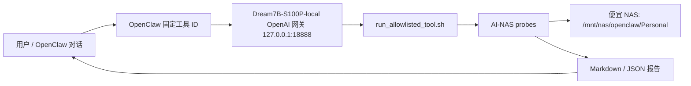

# 低成本 AI-NAS MVP v1 验收报告

日期：2026-06-14

标题：低成本 AI-NAS Copilot：用便宜 NAS + S100P + OpenClaw 平替高端 AI NAS 智能层

## 结论

MVP v1 已形成可演示闭环：便宜 NAS 继续负责存储基础能力，S100P 负责本地 Dream 7B 服务和 AI-NAS 工具执行，OpenClaw 负责自然语言入口、固定 allowlisted tool 调用和审计证据。

本轮验收覆盖了 5 条 OpenClaw live 指令，不是单独 CLI 跑通：

- 扫描 `Personal` 并生成索引。
- 查找 2019 年犯罪电影。
- 总结 `Documents` 并回答付款时间。
- 生成重复文件报告。
- 非破坏式复制整理电影并写 manifest。

所有任务都生成 Markdown/JSON 报告；电影整理额外生成 `movie_sort_manifest.json`。原始文件未删除、未移动、未覆盖。

## 已交付文件

- `docs/ai_nas_mvp/README.md`
- `docs/ai_nas_mvp/product_positioning.md`
- `docs/ai_nas_mvp/high_end_nas_comparison.md`
- `docs/ai_nas_mvp/mvp_acceptance_report.md`
- `docs/ai_nas_mvp/demo_recording_script.md`
- `scripts/probes/ai_nas_common.py`
- `scripts/probes/ai_nas_movie_sort_demo_probe.py`
- `scripts/probes/ai_nas_personal_inventory_probe.py`
- `scripts/probes/ai_nas_index_daemon_readiness_probe.py`
- `scripts/probes/ai_nas_index_daemon_smoke_probe.py`
- `scripts/probes/ai_nas_index_daemon_resident_probe.py`
- `scripts/probes/ai_nas_index_rename_detection_probe.py`
- `scripts/probes/ai_nas_index_observability_contract_probe.py`
- `scripts/probes/ai_nas_sqlite_index_integrity_contract_probe.py`
- `scripts/probes/ai_nas_incremental_scan_efficiency_contract_probe.py`
- `scripts/probes/ai_nas_index_search_isolation_slo_probe.py`
- `scripts/probes/ai_nas_file_search_probe.py`
- `scripts/probes/ai_nas_permission_aware_search_probe.py`
- `scripts/probes/ai_nas_embedding_search_probe.py`
- `scripts/probes/ai_nas_embedding_backend_readiness_probe.py`
- `scripts/probes/ai_nas_embedding_runtime_contract_probe.py`
- `scripts/probes/ai_nas_case_packet_probe.py`
- `scripts/probes/ai_nas_semantic_query_acceptance_probe.py`
- `scripts/probes/ai_nas_search_evidence_contract_probe.py`
- `scripts/probes/ai_nas_search_confidence_calibration_contract_probe.py`
- `scripts/probes/ai_nas_multimodal_intent_routing_contract_probe.py`
- `scripts/probes/ai_nas_operator_portal_contract_probe.py`
- `scripts/probes/ai_nas_action_approval_manifest_probe.py`
- `scripts/probes/ai_nas_action_manifest_integrity_probe.py`
- `scripts/probes/ai_nas_operator_approval_inbox_probe.py`
- `scripts/probes/ai_nas_action_execute_copy_probe.py`
- `scripts/probes/ai_nas_action_rollback_copy_probe.py`
- `scripts/probes/ai_nas_destructive_action_governance_probe.py`
- `scripts/probes/ai_nas_audit_trail_contract_probe.py`
- `scripts/probes/ai_nas_appliance_experience_acceptance_probe.py`
- `scripts/probes/ai_nas_production_dependency_bundle_probe.py`
- `scripts/probes/ai_nas_production_blocker_runbook_contract_probe.py`
- `scripts/probes/ai_nas_evidence_catalog_contract_probe.py`
- `scripts/probes/ai_nas_objective_traceability_contract_probe.py`
- `scripts/probes/ai_nas_evidence_freshness_contract_probe.py`
- `scripts/probes/ai_nas_portable_nas_adapter_contract_probe.py`
- `scripts/probes/ai_nas_production_readiness_gate_probe.py`
- `scripts/probes/ai_nas_acl_mapping_readiness_probe.py`
- `scripts/probes/ai_nas_concurrency_stability_probe.py`
- `scripts/probes/ai_nas_continuous_task_soak_probe.py`
- `scripts/probes/ai_nas_soak_checkpoint_resume_probe.py`
- `scripts/probes/ai_nas_queue_backpressure_slo_probe.py`
- `scripts/probes/ai_nas_user_facing_tail_latency_probe.py`
- `scripts/probes/ai_nas_bpu_headroom_slo_probe.py`
- `scripts/probes/ai_nas_operational_slo_rollup_contract_probe.py`
- `scripts/probes/ai_nas_allowlist_governance_audit_probe.py`
- `scripts/probes/ai_nas_model_service_resilience_probe.py`
- `scripts/probes/ai_nas_model_service_recovery_drill_probe.py`
- `scripts/probes/ai_nas_model_service_recovery_manifest_probe.py`
- `scripts/probes/ai_nas_ocr_runtime_contract_probe.py`
- `scripts/probes/ai_nas_ocr_extract_probe.py`
- `scripts/probes/ai_nas_document_pipeline_acceptance_probe.py`
- `scripts/probes/ai_nas_folder_rag_probe.py`
- `scripts/probes/ai_nas_folder_rag_grounding_contract_probe.py`
- `scripts/probes/ai_nas_folder_summary_probe.py`
- `scripts/probes/ai_nas_duplicate_report_probe.py`
- `scripts/probes/ai_nas_image_embedding_extract_probe.py`
- `scripts/probes/ai_nas_photo_semantic_search_probe.py`
- `scripts/probes/ai_nas_photo_pipeline_acceptance_probe.py`
- `scripts/probes/ai_nas_photo_privacy_governance_probe.py`
- `scripts/probes/ai_nas_movie_sort_enhanced_probe.py`
- `scripts/probes/ai_nas_allowlisted_tool.sh`
- `完全基于agent的s100使用和链路打通/scripts/run_allowlisted_tool.sh`
- `完全基于agent的s100使用和链路打通/scripts/tool_allowlist.json`
- `完全基于agent的s100使用和链路打通/scripts/dream7b_local_openai_gateway.py`
- `完全基于agent的s100使用和链路打通/openclaw-plugins/s100p-allowlisted-tools/index.js`

## 架构



## Dream 7B 默认服务证据

`dream7b-default-status` 当前结果：

```text
service: dream7b-bpu-batch-queue.service
active/enabled: active / enabled
segment_major_24x256_default: True
latest soak avg_bpu: 93.037 failed_jobs=0
latest telemetry avg_bpu: 93.014 failed_jobs=0
OpenClaw model: dream7b-local/Dream7B-S100P-local base_url=http://127.0.0.1:18888/v1
```

运行时服务：

- `openclaw-gateway.service`: active
- `dream7b-local-openai-gateway.service`: active
- `http://127.0.0.1:18789/health`: `{"ok":true,"status":"live"}`
- `http://127.0.0.1:18888/health`: `{"ok": true, "model": "Dream7B-S100P-local", "backend": "dream7b-text"}`

## OpenClaw Live 证据

批量 live-demo 证据：

- `/mnt/nas/openclaw/reports/ai_nas_mvp/openclaw_live_demo_20260614-135822/openclaw_live_demo.md`
- `/mnt/nas/openclaw/reports/ai_nas_mvp/openclaw_live_demo_20260614-135822/openclaw_live_demo.json`

该证据由 OpenClaw websocket `chat.send` 连续触发 5 条指令生成。5 条指令均返回 `final`，并且每条都生成了新的任务报告。

| OpenClaw 指令 | 状态 | 新报告 |
|---|---:|---|
| `ai_nas_personal_inventory` | final | `/mnt/nas/openclaw/reports/ai_nas_mvp/personal_inventory_20260614-215823/personal_inventory.md` |
| `ai_nas_file_search` | final | `/mnt/nas/openclaw/reports/ai_nas_mvp/file_search_20260614-215825/file_search.md` |
| `ai_nas_folder_summary` | final | `/mnt/nas/openclaw/reports/ai_nas_mvp/folder_summary_20260614-215827/folder_summary.md` |
| `ai_nas_duplicate_report` | final | `/mnt/nas/openclaw/reports/ai_nas_mvp/duplicate_report_20260614-215829/duplicate_report.md` |
| `ai_nas_movie_sort_enhanced` | final | `/mnt/nas/openclaw/reports/ai_nas_mvp/movie_sort_enhanced_20260614-215831/movie_sort_enhanced.md` |

Dream 7B 本地网关 trace 中同步记录了 5 条：

- `event=ai_nas_inline_result`
- `execution_path=gateway_fixed_ai_nas_allowlisted_runner`
- `runner=/root/.openclaw/workspace/scripts/run_allowlisted_tool.sh`
- `fixed_args=[]`
- `returncode=0`

## NAS 报告结果

最新 live 批次：

- Inventory: `type_counts={'Documents': 3, 'Inbox': 1, 'Movies': 2, 'Photos': 2}`
- Search: query `找一下 2019 年的犯罪电影`，top result `Movies/Joker.2019.Crime.movie.txt`，confidence `0.95`
- Folder summary: folder `Documents`，`parse_failures=[]`，回答包含付款/发票相关证据
- Duplicate report: `duplicate_group_count=1`，`delete_performed=false`，`move_performed=false`，`requires_human_confirmation=true`
- Movie sort: `movie_count=2`，`copy_sort_executed=true`
- Manifest: `operation=non_destructive_movie_copy_sort`，`delete=false`，`move=false`，`overwrite=false`

## Allowlist 状态

远端已部署并校验：

- `/root/.openclaw/workspace/scripts/run_allowlisted_tool.sh`
- `/root/.openclaw/workspace/scripts/tool_allowlist.json`
- `/root/.openclaw/workspace/scripts/probes/ai_nas_*`
- `/root/.openclaw/extensions/s100p-allowlisted-tools/index.js`
- `/root/.openclaw/workspace/plugins/s100p-allowlisted-tools/index.js`
- `/root/.openclaw/workspace/plugin-staging/s100p-allowlisted-tools/index.js`

固定工具 ID：

- `ai_nas_personal_inventory`
- `ai_nas_index_daemon_readiness`
- `ai_nas_index_daemon_smoke`
- `ai_nas_index_daemon_resident`
- `ai_nas_index_systemd_daemon_install`
- `ai_nas_index_rename_detection`
- `ai_nas_index_observability_contract`
- `ai_nas_sqlite_index_integrity_contract`
- `ai_nas_incremental_scan_efficiency_contract`
- `ai_nas_index_search_isolation_slo`
- `ai_nas_file_search`
- `ai_nas_permission_aware_search`
- `ai_nas_embedding_search`
- `ai_nas_embedding_backend_readiness`
- `ai_nas_embedding_runtime_contract`
- `ai_nas_case_packet`
- `ai_nas_semantic_query_acceptance`
- `ai_nas_search_evidence_contract`
- `ai_nas_search_confidence_calibration_contract`
- `ai_nas_multimodal_intent_routing_contract`
- `ai_nas_operator_portal_contract`
- `ai_nas_action_approval_manifest`
- `ai_nas_action_manifest_integrity`
- `ai_nas_operator_approval_inbox`
- `ai_nas_action_execute_copy`
- `ai_nas_action_rollback_copy`
- `ai_nas_destructive_action_governance`
- `ai_nas_audit_trail_contract`
- `ai_nas_appliance_experience_acceptance`
- `ai_nas_production_dependency_bundle`
- `ai_nas_production_blocker_runbook_contract`
- `ai_nas_evidence_catalog_contract`
- `ai_nas_objective_traceability_contract`
- `ai_nas_evidence_freshness_contract`
- `ai_nas_portable_nas_adapter_contract`
- `ai_nas_production_readiness_gate`
- `ai_nas_acl_mapping_readiness`
- `ai_nas_concurrency_stability`
- `ai_nas_continuous_task_soak`
- `ai_nas_nas_backed_long_soak`
- `ai_nas_soak_checkpoint_resume`
- `ai_nas_queue_backpressure_slo`
- `ai_nas_user_facing_tail_latency`
- `ai_nas_bpu_headroom_slo`
- `ai_nas_operational_slo_rollup_contract`
- `ai_nas_allowlist_governance_audit`
- `ai_nas_model_service_resilience`
- `ai_nas_model_service_recovery_drill`
- `ai_nas_model_service_recovery_manifest`
- `ai_nas_model_service_real_recovery_drill`
- `ai_nas_ocr_runtime_contract`
- `ai_nas_ocr_extract`
- `ai_nas_document_pipeline_acceptance`
- `ai_nas_folder_rag`
- `ai_nas_folder_rag_grounding_contract`
- `ai_nas_folder_summary`
- `ai_nas_duplicate_report`
- `ai_nas_image_embedding_extract`
- `ai_nas_photo_semantic_search`
- `ai_nas_photo_pipeline_acceptance`
- `ai_nas_photo_privacy_governance`
- `ai_nas_movie_sort_enhanced`

校验结果：

- `bash -n run_allowlisted_tool.sh`: pass
- `python3 -m json.tool tool_allowlist.json`: pass
- `python3 -m py_compile scripts/probes/ai_nas_*.py`: pass
- `node --check` for OpenClaw plugin `index.js`: pass

## Current S100P Production Closure Evidence

- `ai-nas-index-daemon.service` has been installed on the S100P as a systemd system service and currently reports `active/enabled`.
- Latest install verification: `/mnt/nas/openclaw/reports/ai_nas_mvp/index_systemd_daemon_install_20260617-124446-764151/index_systemd_daemon_install.json`, verdict `ok_ai_nas_index_systemd_daemon_install`, `observed_cycles=7`, `min_observed_cycles=3`, `blockers=[]`.
- Latest production gate after the 1-hour NAS-backed soak and refreshed blocker runbook: `/mnt/nas/openclaw/reports/ai_nas_mvp/production_readiness_gate_20260617-152553-598382/production_readiness_gate.json`; the remaining production warnings are `production_nas_backed_long_soak_not_verified` and `face_recognition_remains_out_of_scope_until_privacy_review`. The earlier systemd daemon, OCR runtime, embedding fallback, photo CLIP fallback, and real service recovery warnings are no longer reported.
- NAS-backed long soak now has a full-duration run against the real mounted NFS-backed Personal root: `/mnt/nas/openclaw/reports/ai_nas_mvp/nas_backed_long_soak_20260617-141820-986479/nas_backed_long_soak.json` has `nas_backed=true`, `elapsed_seconds=3600.453`, `wave_count=343`, `final_file_count=8`, `final_failed_count=0`, `p95_ms=49.9223`, `p99_ms=57.2232`, and all index waves completed. It remains `limited` only because the real Personal scan set is below the production minimum file count.
- Production blocker runbook evidence is current: `/mnt/nas/openclaw/reports/ai_nas_mvp/production_blocker_runbook_contract_20260617-152525-287649/production_blocker_runbook_contract.json`, verdict `ok_ai_nas_production_blocker_runbook_contract`, with all 31 required gate findings covered by owner category, operator steps, verification commands, and acceptance evidence.
- OCR runtime is production-ready on the S100P in the latest contract: `/mnt/nas/openclaw/reports/ai_nas_mvp/ocr_runtime_contract_20260617-124548-833713/ocr_runtime_contract.json`, verdict `ok_ai_nas_ocr_runtime_contract`, `/usr/bin/tesseract` available, OCR smoke passing.
- Embedding and CLIP now have S100P production-runtime evidence: `/mnt/nas/openclaw/reports/ai_nas_mvp/embedding_runtime_contract_20260617-130558-289831/embedding_runtime_contract.json`, verdict `ok_ai_nas_embedding_runtime_contract`, with production text embedding ready via `transformers.AutoModel.mean_pooling` over `/mnt/nas/openclaw/models/ai_nas_text_all_minilm_l6_v2` and image CLIP ready via `transformers.CLIPModel` over `/mnt/nas/openclaw/models/ai_nas_clip_vit_base_patch32`.
- Production dependency evidence is closed in `/mnt/nas/openclaw/reports/ai_nas_mvp/production_dependency_bundle_20260617-130640-198409/production_dependency_bundle.json`, verdict `ok_ai_nas_production_dependency_bundle`, `ready_count=5`, `blocked_count=0`.
- Model-service recovery has real service-scoped restart evidence: `/mnt/nas/openclaw/reports/ai_nas_mvp/model_service_real_recovery_drill_20260617-125704-251183/model_service_real_recovery_drill.json`, verdict `ok_ai_nas_model_service_real_recovery_drill`, `recovered_count=3`, `real_service_restart_performed=true`, `real_service_kill_performed=false`.

OpenClaw 没有开放任意 shell 或任意脚本路径；AI-NAS live 路径只接受固定工具 ID，固定参数执行。

## 验收清单

| 要求 | 状态 | 证据 |
|---|---:|---|
| Dream 7B 默认服务 active/enabled | Pass | `dream7b-default-status` |
| segment-major 24x256 默认路线为 true | Pass | `segment_major_24x256_default: True` |
| Personal 文件库索引成功 | Pass | `personal_inventory_20260614-215823` |
| 覆盖两个以上类别 | Pass | Movies、Documents、Photos、Inbox |
| OpenClaw 完成 4 条以上 AI-NAS 指令 | Pass | `openclaw_live_demo_20260614-135822` 覆盖 5 条 |
| 自然语言文件搜索 | Pass | `file_search_20260614-215825` |
| 文件夹摘要 / 文档问答 | Pass | `folder_summary_20260614-215827` |
| 电影整理增强 | Pass | `movie_sort_enhanced_20260614-215831` |
| 重复文件报告 | Pass | `duplicate_report_20260614-215829` |
| 不删除原文件 | Pass | duplicate/movie manifest 均为 false |
| 不移动原文件 | Pass | duplicate/movie manifest 均为 false |
| 不覆盖原文件 | Pass | movie manifest `overwrite=false` |
| 复制整理写 manifest | Pass | `movie_sort_manifest.json` |
| 每次任务有 Markdown/JSON 报告 | Pass | 5 条 live 指令均有 `.md` 和 `.json` |
| 所有工具走 allowlist | Pass | trace 显示 `gateway_fixed_ai_nas_allowlisted_runner` |
| 最终文档区存在 | Pass | `docs/ai_nas_mvp/` |
| 录屏脚本存在 | Pass | `demo_recording_script.md` |

## 安全策略

- 默认只读扫描。
- 不自动删除文件。
- 不自动移动源文件。
- 不覆盖已有目标文件。
- 电影整理仅复制并写 manifest。
- 重复文件只报告，不清理。
- 每个任务写 Markdown/JSON 审计证据。
- OpenClaw 只暴露固定 allowlisted tool ID。
- `ai_nas_allowlist_governance_audit` 已对 69 个 canonical `ai_nas_*` 工具完成治理审计：input schema、permission level、writesFiles、requiresConfirmation、reportPathPolicy、approved prefixes、runner exposure、OpenClaw plugin exposure、query schema alignment 和 source/deploy script parity 均为 0 hard issues / 0 warnings；当前 69 个 source scripts、69 个 deploy scripts 均存在且 SHA256 一致。

## 当前差距

- OCR 引擎还不是产品级；P0 已能检测疑似扫描 PDF、报告 OCR runtime readiness、通过 `ai_nas_ocr_runtime_contract` 区分 PDF text-layer 抽取、扫描件检测、扫描件 OCR smoke、缺失 runtime 和 operator acceptance steps，通过 `ai_nas_ocr_extract` 写入 SQLite `ocr_results` 状态，并通过 `ai_nas_document_pipeline_acceptance` 回归验证 text-layer PDF、OCR-required 扫描 PDF、合同/票据/论文/说明书分类、文件夹级证据问答和 no-answer 显式状态；对解析失败或缺少 OCR runtime 明确记录原因，不编造内容。生产 gate 的 scanned-content blocked warning 现在只在生产 OCR readiness 证据缺失时保留，OCR runtime 和扫描件 OCR smoke 通过后不会继续误报。
- 后台索引服务化已新增 `ai_nas_index_daemon_readiness`、`ai_nas_index_daemon_smoke`、`ai_nas_index_daemon_resident`、`ai_nas_index_rename_detection`、`ai_nas_index_observability_contract`、`ai_nas_sqlite_index_integrity_contract`、`ai_nas_incremental_scan_efficiency_contract` 和 `ai_nas_index_search_isolation_slo`：前者覆盖连续索引周期、daemon SQLite 状态、stale-lock 恢复、事件源能力检测、recent `change_log` 可观测性和 systemd service-unit 草案；smoke 在隔离 Personal fixture 中验证 create/update/delete 通过真实 SQLite/FTS `change_log` 被检测；resident probe 启动本 probe 拥有的子进程持续轮询，在 worker 运行时修改 fixture 并验证 heartbeat 与 add/update/delete 检测 P95/P99；rename detection 在隔离 fixture 中验证旧路径 `deleted`、新路径 `added`、SHA256 相同，并产出 `rename_or_move` 候选；observability contract 在隔离 fixture 中验证 last scan timestamps、failed files、queue progress、recent changes、mtime/hash update 和 parse failure no-content-invented 均可查询；SQLite integrity contract 验证 required tables/indexes、PRAGMA integrity checks、records/FTS/vector rows 一致、删除文件后无 orphan rows 且搜索仍有 evidence/confidence；incremental scan efficiency contract 直接验证 no-change scan 不调用 `build_record_for_path`，后续增量扫描只重建 added/updated 文件并通过 `change_log` 记录 deleted 文件；index/search isolation SLO 在后台增量索引运行时并发执行交互搜索，要求结果持续带理由、证据、置信度且搜索 P95/P99 达标。现在已补 `scripts/probes/ai_nas_index_daemon.py` 常驻 poller、`configs/systemd/ai-nas-index-daemon.service` 模板和 `ai_nas_index_systemd_daemon_install` 只读安装验证；当前 S100P 已跑出 `ok_ai_nas_index_systemd_daemon_install`，真实设备 active/enabled、Restart policy 和 daemon cycle 证据已清除对应 production warning。
- 权限感知搜索已新增 `ai_nas_permission_aware_search`：基于本地 role/path/sensitivity policy overlay 对搜索候选做 allow/deny，允许结果保留理由、证据和置信度，拒绝结果只返回 redacted ID 和拒绝原因；`ai_nas_acl_mapping_readiness` 已补上生产 NAS ACL / 用户映射只读 readiness，检查 Personal root、owner/group/mode 样本、POSIX ACL/identity 工具、SMB/user mapping hints 和 principal mapping config blockers；当前仍不是生产 NAS ACL 强制执行。
- Embedding/vector search 已接入轻量 SQLite 向量表和 `local_hash_embedding_v1` 余弦排序报告；`ai_nas_embedding_backend_readiness` 已补上生产 embedding 后端合同检查：本地 sentence-transformer、CLIP/open_clip/transformers runtime、本地模型目录、SQLite vector rows、local-only smoke 和 no-download/no-network 策略都会被报告；`ai_nas_embedding_runtime_contract` 进一步把本地 hash/PIL fallback plumbing 与生产 sentence-transformer/CLIP smoke 分开，明确缺失 runtime、模型目录、operator acceptance steps、no-download/no-network 和 face-recognition out-of-scope；`ai_nas_semantic_query_acceptance` 已用 bounded fixture 回归验证“去年签的装修合同 / 孩子海边照片 / 报销发票”三类模糊查询的 top result 必须带理由、证据片段和置信度，并对 person/CLIP 语义缺口显式说明；`ai_nas_search_evidence_contract` 进一步横跨 SQLite/FTS text search、local hash embedding、photo semantic search、folder RAG、mixed case packet 和 user-facing case results，要求每个已接受结果带 path/original path、reasons、evidence、confidence 和审计 grounding；`ai_nas_search_confidence_calibration_contract` 继续约束置信度边界：强合同/发票查询必须 grounded，unsupported/private-identifier 查询不得高置信，child/person photo 查询必须保持 metadata-only 并说明不做人脸识别；`ai_nas_multimodal_intent_routing_contract` 把理想查询拆成 contract/invoice/receipt/chat/screenshot/payment/report/approval/audit intents，并验证 SQLite/FTS、local embedding、photo semantic、folder RAG、case packet 和 human-confirmed approval suggestion 全链路路由。当前 S100P 已预置本地 text embedding 和 CLIP 模型目录，并通过 `ok_ai_nas_embedding_runtime_contract` 验证生产 text embedding 与 image CLIP smoke；生产 gate 不再误报 `local_hash_embedding_v1` 或照片 CLIP fallback warning。
- 文件夹级 RAG 已接入 `ai_nas_folder_rag`，并由 `ai_nas_document_pipeline_acceptance` 在 bounded document fixture 上验证证据、理由、金额/日期/付款节点和 no-answer 缺口；`ai_nas_folder_rag_grounding_contract` 进一步要求 payment/date/amount nodes 必须回指到 matched file、reasons、evidence、confidence，解析失败必须显式列出，unsupported identifier 问题必须返回 no-answer 而不是编造内容；但还不是完整 LLM 生成式 RAG。
- `ai_nas_case_packet` 已覆盖理想体验中的混合证据包：对 `2024 renovation payment contract invoice receipt chat screenshot` fixture 返回 3 个证据文件（合同、报销发票、发票截图）、2 组付款/日期/金额节点、copy-only 整理建议、3 个 rejected candidates 和 chat screenshot 未验证缺口，全程不移动/删除/覆盖源文件。
- `ai_nas_appliance_experience_acceptance` 已把理想产品体验固化成端到端验收：固定查询 `2024 renovation payment contract invoice receipt chat screenshot` 必须返回相关文件列表、每个文件为什么匹配、证据片段、摘要、金额/日期/付款节点、原始路径、置信度、可复制整理建议、一键 Markdown/JSON 报告、审批 manifest、阻断的破坏性动作和可审计记录；`ai_nas_operator_portal_contract` 已进一步生成并验证单入口静态 HTML/JSON portal，展示查询、相关文件、证据、付款节点、整理建议、审批队列、阻断的破坏性动作、审计状态、最新 production readiness、operational SLO、objective traceability、production dependency bundle 和 blocker runbook 验证命令。
- `ai_nas_production_dependency_bundle` 已把外部生产依赖整理成一个只读证据包：统一记录 NAS mount/ACL、text embedding、image CLIP、OCR、model/OpenClaw health、systemd restart policy 和 operator recovery-drill next steps；`ai_nas_production_blocker_runbook_contract` 进一步读取最新 production gate blockers（冷启动时回退到当前基线 blockers）并映射到 owner category、remediation steps、AI-NAS verification commands 和 acceptance evidence；这些工具不安装依赖、不下载模型、不重启服务，只把缺口集中成可审计 blockers 和可执行上线清单。
- `ai_nas_evidence_catalog_contract` 已把 AI-NAS 报告证据纳入 SQLite provenance catalog：记录 report type、tool_id、tool_id_source、verdict、generated_at、mtime、path、SHA256、summary、parse error、latest-for-type 和 forbidden audit flags，并能从顶层 `tool_id`、`audit.tool_id` 或固定报告文件名映射 canonical tool ID，提供 `latest_evidence_reports` 查询视图，并对 69 个 canonical allowlisted `ai_nas_*` 工具输出报告覆盖摘要，方便运营/审计按报告类型、工具和哈希追踪证据；`ai_nas_objective_traceability_contract` 进一步把原始 AI-NAS Copilot Appliance 目标拆成可审计矩阵：P95/P99、连续吞吐、队列、恢复、索引产品化、embedding 搜索、OCR/RAG、照片、OpenClaw 治理、appliance 体验和生产 blockers 均映射到当前报告、limited 状态和缺失证据，防止后续工作漂移成 NAS OS 或普通文件管理器；`ai_nas_evidence_freshness_contract` 已把生产门禁使用的证据报告纳入 freshness/provenance 审核：检查关键报告存在、30 天内新鲜、tool_id/verdict 匹配，并拒绝带有 forbidden destructive audit flags 的证据；production gate 和 freshness 选择最新报告时优先使用 JSON `generated_at`，文件 mtime 只作为兜底，避免旧失败报告因 mtime 异常覆盖新证据。
- `ai_nas_portable_nas_adapter_contract` 已把“不是 NAS OS、不是文件管理器，而是可接任意便宜 NAS 的 AI Copilot Appliance”固化成 adapter 验收：两个隔离 NAS Personal root 均能独立建 SQLite/FTS 索引、返回带理由/证据/置信度的搜索结果、路径 confined 在各自 Personal root 内，报告和索引写在源树外，源文件 hash/mtime 不变。
- `ai_nas_production_readiness_gate` 已把“什么时候才能声称 production-ready”变成严格门禁：当前必须逐项检查真实 NAS 索引、常驻 daemon、P95/P99 队列 soak、生产 embedding/CLIP、OCR、照片 pipeline、真实 NAS ACL/user mapping、模型服务恢复、端到端 appliance 体验、生产依赖证据包、证据 freshness/provenance 和 OpenClaw allowlist 治理；缺少强证据时输出 `limited_ai_nas_production_readiness_gate` 和明确 blockers。systemd daemon 安装、NAS-backed 长跑和真实服务恢复演练三个生产 warning 现在只在对应 `ai_nas_index_systemd_daemon_install`、`ai_nas_nas_backed_long_soak`、`ai_nas_model_service_real_recovery_drill` 缺少 `ok` 报告时保留；`ai_nas_production_blocker_runbook_contract` 也已从只覆盖 blockers 扩展为覆盖 gate 的 blockers 和 warnings，当前 gate 的每个 required finding 都会映射到 owner、operator steps、verification commands 和 acceptance evidence。
- `ai_nas_action_approval_manifest` 已把 copy-only 整理建议升级为可审批 manifest：每个候选动作有 `action_id`、source SHA256、target path、preconditions、approval phrase、rollback plan、manifest SHA256 和审计输出；move/delete/overwrite/rename 均被显式阻断，本工具不执行复制、移动、删除或覆盖。
- `ai_nas_action_manifest_integrity` 已补上 approval manifest 完整性合同：在隔离 fixture 中验证合法 manifest 可通过 executor-side 校验，并拒绝 target path 篡改、manifest rehash 但 action_id 过期、source hash 缺失和 approval phrase mismatch，执行入口在复制前会复算 manifest SHA256 与 action_id；`ai_nas_operator_approval_inbox` 已把 approval manifests 汇总成 report-only 待审批队列，区分 ready-for-review、needs-repair、approved/rejected 状态，并检查 exact approval phrase、source hash、rollback plan、blocked destructive actions 和审计状态，批准前不执行任何动作。
- `ai_nas_action_execute_copy` 已补齐“人工确认 -> 执行 -> 回滚/manifest”的 copy-only 闭环：只接受 approval manifest 和精确 approval phrase，复算 manifest SHA256 与 action_id，重新校验 source SHA256、target 不存在、目标在 `Personal/Collections` 下，然后复制并生成 execution manifest 与 rollback manifest；仍然不执行 delete/move/overwrite。
- `ai_nas_action_rollback_copy` 已补齐已执行 copy-only 动作的回滚执行：只接受 rollback manifest 和精确 rollback phrase，只在校验目标 SHA256 一致时删除 `Personal/Collections` 下已复制的目标文件，不碰源文件、不移动、不覆盖、不递归删目录。
- `ai_nas_destructive_action_governance` 已补上破坏性动作治理合同：在隔离 fixture 中验证 copy action 必须保留人工确认、preconditions 和 rollback plan，move/delete/overwrite/rename 只作为 `blocked_not_generated` 出现在报告里，并且 execution/rollback 层会拒绝 delete action、destructive copy、Collections 外复制、错误 rollback phrase 和 Collections 外 rollback。
- `ai_nas_audit_trail_contract` 已补上跨步骤审计链合同：在隔离 fixture 中把 query_received、index_refreshed、case_packet_built、approval_manifest_created、destructive_actions_blocked、copy_executed、rollback_manifest_created、rollback_executed 和 final_report_written 写成 hash-chained JSONL/SQLite ledger，并验证 source preserved、rollback 后无 copied targets 残留和 final event hash。
- P95/P99 benchmark 已扩展为混合 search / embedding_search / folder_rag / index 工作负载，并把每轮摘要追加到 SQLite `perf_benchmark_runs` 历史表；`ai_nas_continuous_task_soak` 进一步用多波次 index/search/folder-RAG 队列验收连续任务吞吐、queue wait P95/P99、task P95/P99、失败/未完成任务、绝对 SLO 阈值和带最小基线的跨波次 P95 退化，避免极小首波 P95 把正常抖动放大成误判；`ai_nas_nas_backed_long_soak` 已补上真实 Personal root 上的只读长跑入口，要求 NAS-backed path、最小时长、最小文件量、零失败索引和 P95/P99 SLO 证据；`ai_nas_soak_checkpoint_resume` 已补上长任务中断恢复合同：模拟 running job 崩溃、写入 hash-chained checkpoints、恢复 pending/running 状态、继续执行并验证所有 idempotency key 只完成一次；`ai_nas_queue_backpressure_slo` 已补上队列治理验收：后台任务达到阈值后被背压拒绝，交互任务不被低优先级队列拒绝，交互 queue wait P95/P99 必须满足 SLO，失败任务重试后进入 dead-letter，且不允许有未完成任务；`ai_nas_user_facing_tail_latency` 进一步把 SQLite text search、local hash embedding search、photo semantic search、folder RAG 和 case packet 五个用户入口纳入 P95/P99 与 grounding 合同，要求结果带理由、证据、置信度，case packet 还必须有付款节点和 copy suggestion；`ai_nas_bpu_headroom_slo` 已把“不追 100% BPU”固化为调度验收：平均利用率必须在 93-95 percent，P95/P99 不越界，P01 headroom 保留余量，交互任务优先且后台任务只能使用剩余 capacity；`ai_nas_operational_slo_rollup_contract` 进一步把 tail latency、连续吞吐、队列背压、索引/搜索并发、BPU headroom 和模型恢复证据汇总成一个 operator scorecard，方便生产运营查看整体 SLO 状态，但 fixture/短跑仍不替代真实 NAS-backed 长跑报告。
- 索引任务和搜索/对话入口并发稳定性已接入 `ai_nas_concurrency_stability`：并发运行 index refresh、file search、embedding search、photo semantic search 和 Dream/OpenClaw health checks，记录 P95/P99、吞吐、失败数和 error taxonomy；当前 Windows fixture 验证中索引/搜索任务无失败，但本机 Dream/OpenClaw health endpoint 超时，因此报告为 `limited_ai_nas_concurrency_stability`。
- 图片能力已覆盖基础路径、扩展名、标签、SHA256、EXIF 时间、可解析 GPS 位置、尺寸、pHash、相似图报告、`local_visual_embedding_v1` 图像 embedding 状态表和 `ai_nas_photo_semantic_search` 有界照片语义搜索；`ai_nas_photo_pipeline_acceptance` 已在 bounded fixture 上回归验证 EXIF 时间、GPS 地点、文件夹/路径标签、SHA256、pHash 相似组、local visual embedding rows，以及 `beach`、`white car`、`invoice screenshot`、`meal` 查询必须返回理由、证据和置信度；`ai_nas_photo_privacy_governance` 已将 child/person 照片词条限定为 metadata/path label，明确不执行 face recognition、face embedding 或 identity matching，任何未来人脸模型都必须先经过独立隐私/合规 review。当前 S100P 的生产 CLIP evidence 为 `ok`，照片 CLIP fallback warning 已清除；人脸识别 out-of-scope warning 仍保留到单独隐私审查完成。
- 模型服务崩溃恢复已接入四层治理：`ai_nas_model_service_resilience` 做真实服务 read-only preflight，`ai_nas_model_service_recovery_drill` 用本 probe 拥有的 mock health 子进程做 kill/restart supervisor 演练并记录恢复 P95/P99，`ai_nas_model_service_recovery_manifest` 生成真实服务恢复演练前的 operator approval manifest，包含 preflight health、精确 approval phrase、服务级 restart proposal、blocked unsafe actions、post-checks、rollback plan 和审计合同；`ai_nas_model_service_real_recovery_drill` 只有在 manifest JSON、精确 approval phrase 和 `--execute` 同时满足时才执行 service-scoped `systemctl --user restart`，直接 Python 调用可用 action id 进一步缩小动作范围，不做 PID kill。当前 S100P 已用 operator approval phrase 跑出 `ok_ai_nas_model_service_real_recovery_drill`，真实服务恢复 warning 已清除。
- `configs/systemd/` 已补上 Dream7B queue、Dream7B local OpenAI gateway、OpenClaw gateway 和 AI-NAS index daemon 的 systemd 模板，均包含 Restart/RestartSec 或 start-limit 策略；当前 S100P 已验证 AI-NAS index daemon systemd service active/enabled 且有 daemon cycle 证据，并已完成 Dream7B/OpenClaw service-scoped restart drill。
- OpenClaw 插件已支持对 `ai_nas_file_search`、`ai_nas_evidence_report`、`ai_nas_case_packet`、`ai_nas_action_approval_manifest`、`ai_nas_permission_aware_search`、`ai_nas_embedding_search`、`ai_nas_photo_semantic_search`、`ai_nas_folder_rag` 传入可选单行 `query`；仅 `ai_nas_folder_rag` 支持可选相对 `folder`，仅 `ai_nas_permission_aware_search` 支持可选 `principal`，仅 `ai_nas_action_execute_copy` 支持 `manifest_path`/`approval_phrase`，仅 `ai_nas_action_rollback_copy` 支持 `rollback_manifest_path`/`rollback_phrase`；`ai_nas_model_service_real_recovery_drill` 额外支持 `manifest_path`、`approval_phrase` 和 `execution_mode=execute`，并要求 `approval_phrase` 匹配 `APPROVE-RECOVERY msr-<16 hex>`；其它 allowlisted tool 仍保持固定参数。
- 还没有高端 NAS 那种完整移动 App、相册 UX、生产级权限强制执行和人脸/身份识别能力；后台索引服务在当前 S100P 上已有 systemd active/enabled 与 daemon cycle 证据。
- 当前是 demo-quality 智能层原型，不包装成成熟商用品。

## 汇报口径

我们已经平替的是高端 AI NAS 的“智能层 demo 路径”：文件索引、自然语言搜索、文档/文件夹摘要、电影整理建议和复制整理、重复文件报告、OpenClaw 自然语言触发与审计。

我们不平替 RAID、快照、备份、权限、移动 App、NVR 和 NAS OS。低成本优势来自架构拆分：便宜 NAS 做成熟存储基础，S100P 做本地 AI/runtime，OpenClaw 做安全自然语言控制。
