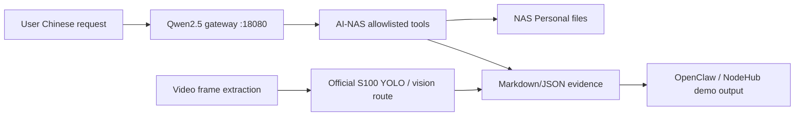

# AI-NAS Competition Delivery 2026-06-23

## Final Goal

Deliver a reproducible AI-NAS Copilot prototype for the RDK S100 competition:

- Official Qwen2.5 text entry for Chinese user requests.
- Official S100 vision route for image and video-frame evidence.
- OpenClaw / allowlisted AI-NAS tools for bounded NAS actions.
- Markdown/JSON evidence for every demo step.
- No destructive NAS operations: no delete, move, overwrite, or source mutation.

## Current Verdict

The integrated competition delivery is demo-ready once the final acceptance
packet reports:

```powershell
py -3 scripts\probes\ai_nas_competition_final_acceptance_packet.py
```

Expected verdict:

```text
ok_ai_nas_competition_final_acceptance
```

## Architecture



## Text Route

Primary document:

- `docs/qwen25_ai_nas_text_entry_2026-06-23.md`

Status:

- Model display name: `Qwen2.5-1.5B-Instruct-S100P-official`
- Gateway: `http://127.0.0.1:18080/v1`
- Service: `qwen25-local-openai-gateway.service`
- Service state from subthread: `active/enabled`
- Final acceptance: `ok_qwen25_ai_nas_acceptance_packet`

Important boundary:

- The official 1024 HBM exists and initializes, but the current S100P run is
  blocked by BPU/common-buffer allocation.
- The competition demo baseline is the official Qwen2.5 512/128 profile:
  `cache_len_512_chunk_128_q8`.

## Vision Route

Primary document:

- `docs/ai_nas_official_vision_route_2026-06-23.md`

Status:

- Official YOLOv8/YOLO11 route verified on S100P.
- Image detection produced 9 boxes and a rendered JPEG.
- Video route uses frame extraction first, then YOLO; frame detection produced
  7 boxes and a rendered JPEG.
- PP-OCRv3 det/rec HBM files load on S100P, but the production OCR wrapper is
  still pending.

## Demo Script

Use this order for a short, stable competition demo:

1. Show S100P model health:

   ```bash
   curl -sS http://127.0.0.1:18080/health
   ```

2. Run the Qwen2.5 AI-NAS text acceptance:

   ```powershell
   py -3 scripts\probes\qwen25_ai_nas_acceptance_packet.py
   ```

3. Run the official vision route packet:

   ```powershell
   py -3 scripts\probes\ai_nas_official_vision_route_packet.py --report-root tmp\ai_nas_official_vision_20260623
   ```

4. Run the final integrated acceptance packet:

   ```powershell
   py -3 scripts\probes\ai_nas_competition_final_acceptance_packet.py
   ```

5. Open the generated final Markdown report and the two YOLO render images.

## Submission Boundary

Claim:

- A local AI intelligence layer for a low-cost NAS, built on RDK S100.
- Official Qwen2.5 provides the text entry.
- Official S100 vision models provide image and video-frame evidence.
- AI-NAS probes produce auditable evidence packets.

Do not claim:

- Dream7B is the product model.
- Qwen 1024 HBM is production-ready on the current S100P memory layout.
- OCR wrapper is fully finished.
- Full video-language understanding is implemented.
- The system performs automatic destructive NAS operations.

## Next Integration Step

If more time is available, wire the final packet into the OpenClaw allowlist as
an additional read-only tool:

```text
ai_nas_competition_final_acceptance
```

Keep it read-only and report-only. It should return Markdown/JSON paths, not
perform NAS file changes.

